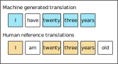

# Evaluation Metrics for Generative Text Models

## Perplexity

- What is Perplexity?

  - In the context of language models, it evaluates the uncertainty of a model in predicting the next word in a sequence.

- Why use Perplexity?

  - Perplexity serves as an inverse probability metric. A lower perplexity indicates that the model’s predictions are closer to the actual outcomes, meaning the model is more confident (and usually more accurate) in its predictions.
 
- How is it calculated?
  - For a probability distribution ${\large p}$ and a sequence of ${\large N}$ words ${\large w_1, w_2, \ldots, w_N}$:

  $${\Huge \text{Perplexity} = p \left(w_1, w_2,\ldots, w_N \right)^{-1/N}}$$
In simpler terms, if we only consider bigrams (two-word sequences) and a model assigns a probability ${\large p}$ to the correct next word, the perplexity would be ${\large 1/p}$.

## Burstiness

- Burstiness implies that if a term is used once in a document, then it is likely to be used again. This phenomenon is called burstiness, and it implies that the second and later appearances of a word are less significant than the first appearance.
- Burstiness can indicate certain patterns or biases in text generation. For instance, if an AI language model tends to repeat certain words or phrases too often in its output, it may suggest an over-reliance on certain patterns or a lack of diverse responses.

## BLEU Score

- BLEU, an acronym for Bilingual Evaluation Understudy was proposed in BLUE: a Method for Automatic Evaluation of Machine Translation and is predominantly used in machine translation. It quantifies the quality of the machine-generated text by comparing it with a set of reference translations.
- In its simplest form, BLEU is the quotient of the matching words under the total count of words in hypothesis sentence (transduction).

### Example

$${\Huge \text{Unigram precision} = \frac{\text{Number of word matches}}{\text{Number of words in generation}} = \frac{4}{5}}$$ 

## ROUGE Score

- ROUGE score stands for Recall-Oriented Understudy for Gisting Evaluation. It was proposed in ROUGE: A Package for Automatic Evaluation of Summaries and is used primarily for evaluating automatic summarization and, sometimes, machine translation.
- The key feature of ROUGE is its focus on recall, measuring how many of the reference n-grams are found in the system-generated summary. This makes it especially useful for tasks where coverage of key points is important. Among its variants, ROUGE-N computes the overlap of n-grams.
- ROUGE-N specifically refers to the overlap of N-grams between the system and reference summaries.
  $${\huge \text{ROUGE-N} = \frac{\text{Number of N-grams in both system and reference summary}}{\text{Total number of N-grams in reference summary}}}$$

$${\Huge \text{ROUGE-1 recall} = \frac{\text{Number of word matches}}{\text{Number of words in reference}} = \frac{5}{5}}$$ 

$${\Huge \text{ROUGE-1 precision} = \frac{\text{Number of word matches}}{\text{Number of words in sumary}} = \frac{5}{6}}$$ 
