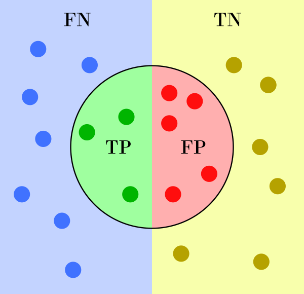
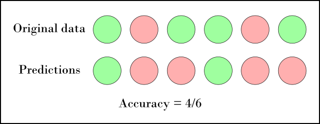
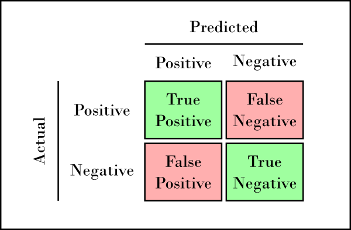
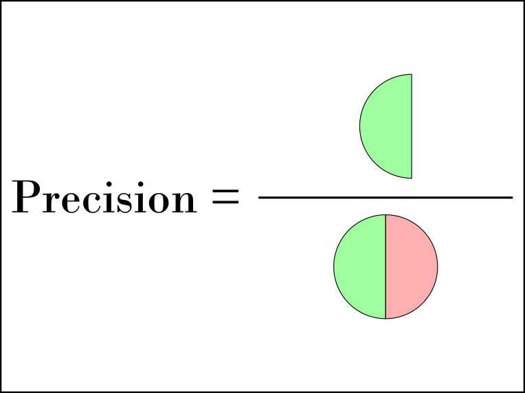
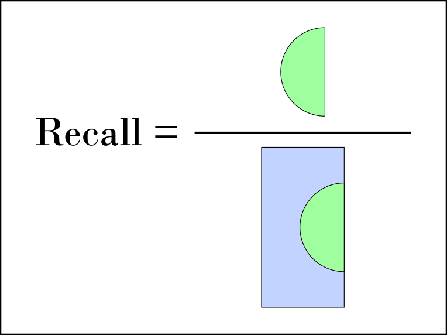

# Evaluation Metrics for the Classification Problem
## Types of Prediction Errors
- False Positive (FP)
- False Negative (FN)
- True Positive (TP)
- True Negative (TN)

## Accuracy

$$\Huge \text{Accuracy} = \frac{\text{number of correct predictions}}{\text{number of correct predictions}}$$

- Useful when the number of samples is balanced

## Confusion Matrix

A table that helps to visualize the performance of a classification algorithm

## Precision and Recall

Precision and Recall metrics are relatively much more appropriate (especially compared to accuracy) when dealing with imbalanced classes.

$$\Huge \text{Precision} = \frac{TP}{TP+FP}$$

$$\Huge \text{Recall} = \frac{TP}{TP+FN}$$

## F1 Score

Weighted average of the precision and recall.

$$\Huge F1 \text{ score} = 2 \frac{\text{Precision} \times \text{Recall}}{\text{Precision} + \text{Recall}}$$

F1 Score = Harmonic mean of Precision and Recall
